# 🎤 WorkFlow AI - Voice-Powered n8n Workflow Generator

[](https://bolt.new)
[](https://supabase.com)
[](https://elevenlabs.io)
[](https://claude.ai)

> **The world's first voice-powered automation builder** - Create complex n8n workflows using just your voice, powered by AI.

## 🏆 Built for Bolt.new Hackathon 2025

# 🤖 WorkFlow AI

"Speak Your Automation Into Existence"

The Universal AI-Powered Automation Platform That Speaks Your Language

Transform your ideas into powerful automation workflows across Zapier, Make.com, and n8n using just your voice. No coding required, no platform expertise needed – just tell WorkFlow AI what you want, and watch the magic happen.

## 🎯 The Problem We Solve

• **Automation Fragmentation**: Different platforms, different formats, steep learning curves
• **Technical Barriers**: Most automation tools require technical expertise
• **Platform Lock-in**: Choose one platform, lose flexibility
• **Time Waste**: Hours spent learning platform-specific interfaces

## 💡 The WorkFlow AI Solution

**One voice command. Three platform outputs. Infinite possibilities.**

**You:** "Sync my Gmail to Slack when I get urgent emails"  
**AI:** _Generates workflows for Zapier, Make.com, and n8n_  
**You:** _Download, import, and automate – in under 60 seconds_

## ✨ Key Features

### 🎙️ Voice-First Interface

• Natural language automation requests
• Real-time voice feedback and confirmation
• Conversational workflow refinement
• Powered by ElevenLabs AI

### 🧠 Universal AI Translation

• Claude Sonnet 4 powers intelligent workflow generation
• Understands business logic, not just technical connections
• Generates custom code when standard nodes aren't enough
• Optimizes workflows for each platform's strengths

### 🔄 Multi-Platform Support

• **Zapier**: Enterprise-ready with webhook support
• **Make.com**: Visual workflows with advanced routing
• **n8n**: Open-source flexibility with custom nodes

### 📊 Smart Comparison Engine

• Cost analysis across platforms
• Complexity scoring for each implementation
• Feature availability matrix
• Performance recommendations

### 🎯 AI Workflow Optimizer

• **Immediate Business Value**: Automatically optimizes workflows for maximum efficiency
• **Performance Analytics**: Real-time insights into workflow execution
• **Smart Suggestions**: AI-powered recommendations for workflow improvements
• **Resource Optimization**: Minimizes API calls and reduces operational costs

### 🎨 Visual Workflow Builder

• **Drag-and-Drop Interface**: Create workflows visually alongside voice commands
• **Real-Time Preview**: See your automation flow before deployment
• **Interactive Demos**: Compelling visual presentations for stakeholders
• **Custom Branding**: White-label visual builder for enterprise clients

### 💰 ROI Calculator

• **Enterprise Viability Proof**: Calculate exact cost savings and efficiency gains
• **Time-to-Value Metrics**: Demonstrate immediate returns on automation investment
• **Comparative Analysis**: ROI across different automation platforms
• **Executive Reporting**: Generate C-suite ready ROI presentations

### 💸 Built-in Monetization

• RevenueCat-powered subscription management
• Freemium model with usage-based pricing
• Enterprise features and white-labeling ready

## 🚀 The Moonshot Feature

### 🌟 AI Workflow Marketplace with Revenue Sharing

**The Game-Changer That Creates Network Effects**

• **Sell Your Success**: Users can monetize their proven workflows
• **AI Customization**: Purchased workflows automatically adapt to buyer's specific needs
• **Revenue Sharing**: WorkFlow AI takes 30% cut of marketplace sales
• **Network Effects**: More users = more workflows = more value for everyone
• **Recurring Revenue**: Create passive income from your automation expertise

**How It Works:**

1. **Create & Validate**: Build successful workflows that solve real problems
2. **List & Price**: Set your price and describe the business value
3. **AI Enhancement**: Our AI makes your workflow adaptable to different use cases
4. **Earn Continuously**: Receive 70% of every sale, forever

**Marketplace Categories:**
• Sales & Marketing Automation
• Customer Service Workflows  
• Data Processing & Analytics
• E-commerce Operations
• HR & Recruitment
• Financial Management

## 🚀 Live Demo

**Try it now:** [workflow-ai-demo.vercel.app](https://workflow-ai-demo.vercel.app)

**Quick Start Examples:**
• "Backup my photos weekly" → Google Drive to Dropbox sync
• "Alert me when someone mentions my brand" → Social media monitoring
• "Send weekly sales reports" → CRM to email automation

## 🛠️ Technical Stack

### Frontend:

```
├── Vite + React 18      # ⚡ Lightning-fast development
├── Tailwind CSS         # 🎨 Beautiful, responsive design
├── Framer Motion        # ✨ Smooth animations
└── Lucide React         # 🎯 Crisp icons
```

### Backend:

```
├── Supabase Edge Functions  # 🔥 Serverless backend
├── Supabase Auth           # 🔐 User authentication
├── Supabase Database       # 📊 Usage tracking & analytics
└── RevenueCat              # 💳 Subscription management
```

### AI & Voice:

```
├── Claude Sonnet 4 API     # 🧠 Workflow generation
├── ElevenLabs API          # 🎤 Voice input/output
└── Custom AI Prompts       # 🎯 Platform-specific generation
```

### Deployment:

```
├── Vercel                  # 🚀 Frontend hosting
├── Supabase Cloud          # ☁️ Backend infrastructure
└── Custom Domain           # 🌐 Professional branding
```

## 🏗️ Architecture Overview

```mermaid
graph TD
    A[🎤 Voice Input] --> B[🧠 Claude AI Processing]
    B --> C[📝 Workflow Generation]
    C --> D[🔄 Multi-Platform Output]
    D --> E[📦 Zapier JSON]
    D --> F[🎯 Make.com JSON]
    D --> G[⚙️ n8n JSON]
    E --> H[💾 Download & Import]
    F --> H
    G --> H
    H --> I[🚀 Live Automation]

    C --> J[🎨 Visual Builder]
    C --> K[📊 ROI Calculator]
    C --> L[🎯 AI Optimizer]

    M[🌟 Marketplace] --> N[💰 Revenue Sharing]
    N --> O[🔄 Network Effects]
```



## 📦 Installation & Setup

### Prerequisites

• Node.js 18+
• Supabase account
• API keys for Claude, ElevenLabs, RevenueCat

### Quick Start

```bash
# Clone the repository
git clone https://github.com/yourusername/workflow-ai.git
cd workflow-ai

# Install dependencies
npm install

# Set up environment variables
cp .env.example .env.local
# Add your API keys to .env.local

# Start development server
npm run dev
```

### Environment Variables

```env
# Supabase
VITE_SUPABASE_URL=your_supabase_url
VITE_SUPABASE_ANON_KEY=your_supabase_anon_key

# Claude AI
VITE_CLAUDE_API_KEY=your_claude_api_key

# ElevenLabs
VITE_ELEVENLABS_API_KEY=your_elevenlabs_api_key

# RevenueCat
VITE_REVENUECAT_API_KEY=your_revenuecat_api_key
```

## 🎯 Supported Automation Platforms

### ⚡ Zapier Integration

• REST Hooks and Webhooks
• 5000+ app integrations
• Enterprise-grade security
• Multi-step Zaps support

### 🎨 Make.com Integration

• Visual scenario builder
• Advanced routing and filtering
• Custom API connections
• Affordable pricing tiers

### 🔧 n8n Integration

• Open-source flexibility
• Self-hosted options
• Custom node development
• Advanced JavaScript/Python execution

## 💡 Use Cases & Examples

### 📈 Business Operations

• Customer onboarding sequences
• Lead qualification workflows
• Invoice processing automation
• Inventory management alerts

### 📱 Social Media Management

• Cross-platform content distribution
• Engagement monitoring
• Hashtag tracking and analytics
• Influencer outreach automation

### 📊 Data Integration

• CRM to marketing tool sync
• Sales report generation
• Database backups and migrations
• API data aggregation

### 🏠 Personal Productivity

• Calendar and task management
• Email organization and filtering
• File backup and organization
• Smart home integrations

## 🏆 Hackathon Challenges

This project is designed to excel in multiple challenge categories:

### 🎙️ Voice AI Challenge

• ElevenLabs integration for natural voice interactions
• Speech-to-automation pipeline
• Voice feedback and confirmations

### 💸 Make More Money Challenge

• RevenueCat subscription management
• Freemium business model
• Enterprise revenue potential
• **Marketplace revenue sharing model**

### 🎨 Most Beautiful UI

• Modern, clean interface design
• Smooth animations and micro-interactions
• Responsive across all devices
• **Interactive visual workflow builder**

### 🚀 Future Unicorn Potential

• $8B+ automation market opportunity
• Platform-agnostic approach
• Clear path to enterprise adoption
• **Network effects through marketplace**

## 📊 Business Model

### 💎 Pricing Tiers

| Feature             | Free      | Pro ($19/mo) | Enterprise       |
| ------------------- | --------- | ------------ | ---------------- |
| Workflows/month     | 5         | Unlimited    | Custom           |
| Platforms           | 1         | All 3        | All + Custom     |
| Voice minutes       | 10        | 500          | Unlimited        |
| Visual Builder      | Basic     | Full         | Advanced         |
| ROI Calculator      | ❌        | ✅           | ✅               |
| AI Optimizer        | ❌        | ✅           | ✅               |
| Marketplace Access  | Buy Only  | Buy & Sell   | Premium Features |
| Support             | Community | Priority     | Dedicated        |
| Custom integrations | ❌        | ❌           | ✅               |
| White-labeling      | ❌        | ❌           | ✅               |

### 📈 Revenue Streams

• **Subscription Revenue**: Monthly/annual plans
• **Usage-Based**: Voice processing overage fees
• **Enterprise Sales**: Custom deployments and integrations
• **Marketplace Commission**: 30% of all workflow sales
• **API Access**: Third-party developer integrations
• **Premium Templates**: Curated workflow collections

## 🤝 Contributing

We welcome contributions from the community! Here's how you can help:

### 🐛 Bug Reports

• Use GitHub Issues with detailed reproduction steps
• Include browser/OS information
• Attach screenshots or recordings when helpful

### ✨ Feature Requests

• Describe the use case and expected behavior
• Explain why this would benefit other users
• Consider implementation complexity

### 🔧 Development

```bash
# Fork the repository
# Create a feature branch
git checkout -b feature/amazing-new-feature

# Make your changes
# Write tests for new functionality
npm run test

# Submit a pull request
```

### 📝 Documentation

• Improve README clarity
• Add workflow examples
• Create video tutorials
• Translate to other languages

## 🔒 Security & Privacy

### 🛡️ Data Protection

• No workflow data stored on our servers
• All processing happens in secure edge functions
• API keys encrypted in transit and at rest
• GDPR and CCPA compliant

### 🔐 API Security

• Rate limiting on all endpoints
• JWT-based authentication
• Supabase Row Level Security (RLS)
• Regular security audits

## 📞 Support & Community

### 💬 Get Help

• **Documentation**: [docs.workflow-ai.com](https://docs.workflow-ai.com)
• **Discord Community**: [discord.gg/workflow-ai](https://discord.gg/workflow-ai)
• **Email Support**: support@workflow-ai.com
• **GitHub Issues**: For bugs and feature requests

### 🌟 Stay Updated

• **Twitter**: [@WorkFlowAI](https://twitter.com/WorkFlowAI)
• **Blog**: [blog.workflow-ai.com](https://blog.workflow-ai.com)
• **Newsletter**: Monthly product updates and tips

## 📄 License

This project is licensed under the MIT License - see the [LICENSE](LICENSE) file for details.

## 🙏 Acknowledgments

• Anthropic for the powerful Claude AI API
• ElevenLabs for revolutionary voice technology
• Supabase for the incredible backend infrastructure
• RevenueCat for seamless subscription management
• The Open Source Community for inspiration and tools

## 🚀 What's Next?

### 🎯 Roadmap 2025

• [ ] Power Automate integration
• [ ] IFTTT support
• [ ] Mobile app (iOS/Android)
• [ ] Chrome extension
• [ ] **Advanced marketplace features** (ratings, reviews, categories)
• [ ] **Team collaboration features**
• [ ] **Advanced analytics dashboard**
• [ ] **White-label solutions**

### 🌍 Global Expansion

• [ ] Multi-language support
• [ ] Regional automation platforms
• [ ] Local payment methods
• [ ] Compliance certifications

---

**Built with ❤️ for the World's Largest Hackathon**

Transform your ideas into automation. Start speaking your workflows into existence today.

[🚀 Try WorkFlow AI Now](https://workflow-ai-demo.vercel.app) | [📚 Documentation](https://docs.workflow-ai.com) | [💬 Join Discord](https://discord.gg/workflow-ai)

**Made with ❤️ by Rahees Ahmed for the Bolt.new Hackathon 2025**

_"Democratizing automation through the power of voice and AI"_
